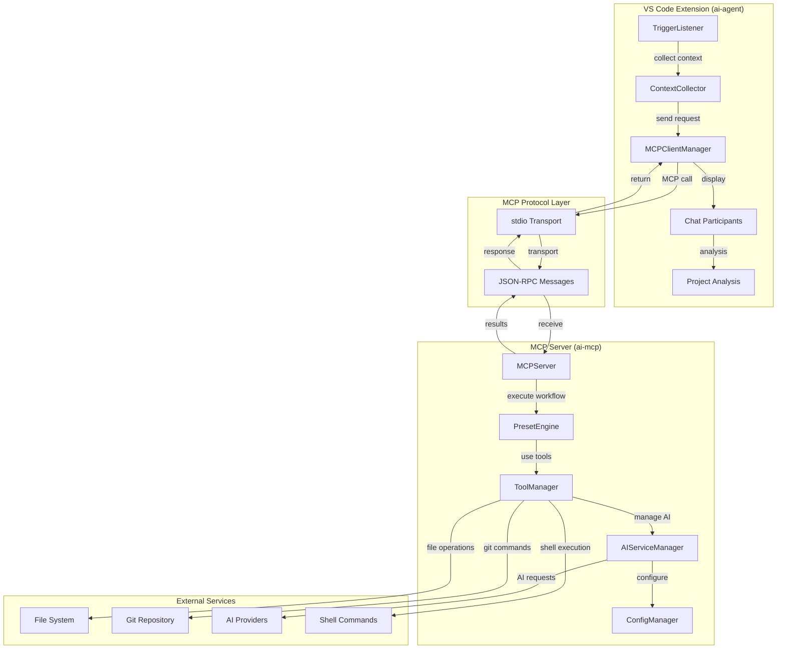
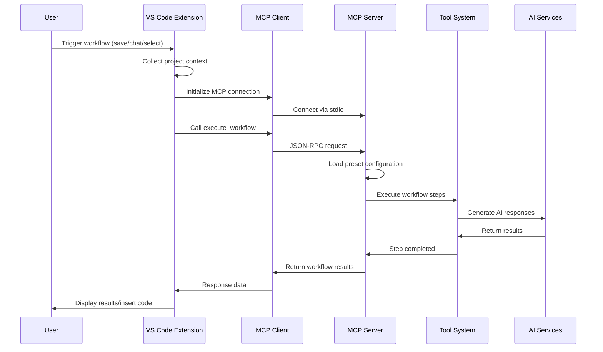
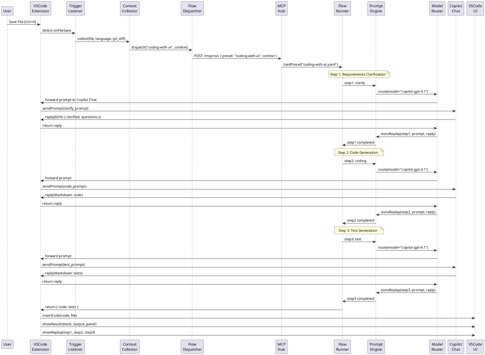

# AI Agent Hub

**Language**: [English](#) | [中文](./README_CN.md)

> AI Agent Hub is a powerful VS Code extension that enhances Copilot Chat with structured, multi-step AI workflows for professional development. It transforms simple chat interactions into sophisticated coding assistants through configurable YAML presets, intelligent context collection, and transparent workflow execution.

🚀 **Current Version**: 0.0.9 (MVP - PoC Validation)

## 🎯 Project Goals

**Enhance Copilot Chat AI programming experience for developers**

- **Structured Workflows**: Define complex multi-step AI programming processes through YAML presets
- **Dynamic Configuration**: Generate analysis configurations for multiple programming languages via Copilot Chat
- **Intelligent Context**: Automatically collect project context for better AI code understanding
- **Transparent & Controllable**: Complete Prompt replay and debugging panels to track every AI reasoning step
- **Automated Triggers**: Auto-start workflows on file save, code selection, or chat input
- **Multi-Agent Collaboration**: Professional agents like coder, tester, requirements working together
- **Multi-Language Support**: Built-in templates for C#, Java, Python, JavaScript, TypeScript, Vue.js, Go, Rust and more

## 📐 System Architecture

### 🔗 Package Integration Overview

AI Agent Hub consists of two main packages that work together through the Model Context Protocol (MCP):

- **`ai-agent`**: VS Code extension that provides the user interface and integrates with Copilot Chat
- **`ai-mcp`**: MCP server that handles workflow execution, tool management, and AI service coordination



### 🔄 Communication Flow



### ⏱ Example Sequence Diagram (Save File Trigger)



## 🚀 Quick Start

### Prerequisites

- Node.js >= 18.x
- VS Code >= 1.80.0
- MCP CLI (`npm install -g ai-mcp`)
- Copilot Chat GPT-4.1 API key (configured in VS Code or environment variables)

### Installation

1. Clone the repository:
   ```bash
   git clone https://github.com/pjy998/ai-agent-hub.git
   cd ai-agent-hub
   ```

2. Install dependencies:
   ```bash
   npm install
   ```

3. Build and start:
   ```bash
   npm run build
   cd packages/ai-agent
   npm run start
   ```

### Usage

- **Chat Trigger**: Enter `ai coding` or `ai requirements` in Copilot Chat.
- **Save Trigger**: Save a file to run `coding-with-ai.yaml`.
- **Selection Trigger**: Select code and trigger `refactor.yaml` via right-click.
- **Prompt Replay**: View logs in `~/.ai-agent-hub/replay/`.

## 🛠️ Core Features (0.0.1)

### 🎯 **Copilot Chat Enhancement Features**
- **Smart Triggers**: Auto-start workflows on file save, code selection, and ai chat
- **Context Enhancement**: Automatically collect file content, Git diffs, project structure, and other contextual information
- **Structured Conversations**: Transform simple chats into multi-step professional programming dialogues

### 🔧 **Workflow Engine**
- **YAML Preset System**: Configurable multi-step AI workflow definitions
- **Multi-Agent Collaboration**: Professional agents for coder, tester, and requirements analysis
- **Process Orchestration**: Advanced flow control including sequential execution, conditional branching, and parallel processing

### 🎨 **Dynamic Configuration Generation**
- **Multi-Language Support**: Built-in templates for C#, Java, Python, JavaScript, TypeScript, Vue.js, Go, Rust
- **AI-Powered Generation**: Use `@ai-agent.config` commands to generate analysis configurations via Copilot Chat
- **Smart Detection**: Automatically detect project languages and suggest appropriate configurations
- **Configuration Validation**: Built-in validation and testing for generated YAML configurations
- **Custom Requirements**: Generate tailored configurations based on specific project needs

### 📊 **Transparency & Debugging**
- **Prompt Replay**: Complete recording of every AI interaction step
- **Debug Panel**: Visualize workflow execution status and results
- **Performance Monitoring**: Track token usage and response times

### 📦 **Preset Workflows**
- **coding-with-ai.yaml**: Requirements clarification → Code generation → Test writing
- **refactor.yaml**: Code analysis → Refactoring suggestions → Test validation
- **requirements-analysis.yaml**: Requirements breakdown → Technical solution → Implementation plan

## 🆚 **Comparison with Regular Copilot Chat**

| Feature | Regular Copilot Chat | AI Agent Hub |
|---------|---------------------|-------------|
| **Interaction** | Single Q&A | Multi-step structured workflows |
| **Context Understanding** | Current file | Project-level context + Git diffs |
| **Specialization** | General AI assistant | Professional coding agent collaboration |
| **Workflow** | Manual guidance | Automated triggering and execution |
| **Transparency** | Black box operation | Complete Prompt replay and debugging |
| **Customization** | Fixed patterns | Flexible YAML-configured workflows |
| **Quality Assurance** | User-dependent validation | Built-in test generation and validation |
| **Learning Curve** | Learn as you go | Configure once, benefit long-term |

### 🎯 **Use Cases**

**Use Regular Copilot Chat when you need:**
- Quick code snippet generation
- Simple question answering
- Temporary code explanation

**Use AI Agent Hub when you need:**
- Complete feature development (requirements → code → tests)
- Large-scale code refactoring
- Standardized AI workflows for team collaboration
- Traceable AI decision processes
- Enterprise-grade code quality assurance

## 📂 Project Structure

```
ai-agent-hub/
├─ packages/
│  ├─ ai-agent/                    # VS Code Extension Package
│  │   ├─ package.json             # Extension manifest & commands
│  │   ├─ src/
│  │   │   ├─ extension.ts          # Main extension entry point
│  │   │   ├─ agents/               # Project analysis agents
│  │   │   │   └─ SelfProjectScanAgent.ts
│  │   │   ├─ context/              # Context collection system
│  │   │   │   └─ collector.ts
│  │   │   └─ mcp/                  # MCP client integration
│  │   │       └─ client.ts
│  │   └─ README.md
│  └─ ai-mcp/                      # MCP Server Package
│      ├─ package.json             # Server dependencies & scripts
│      ├─ src/
│      │   ├─ index.ts             # MCP server main entry
│      │   ├─ ai/                  # AI service management
│      │   │   └─ manager.ts
│      │   ├─ tools/               # Tool system implementation
│      │   │   ├─ index.ts         # Tool registry
│      │   │   ├─ manager.ts       # Tool execution manager
│      │   │   ├─ file/            # File operation tools
│      │   │   └─ shell/           # Shell command tools
│      │   └─ utils/               # Configuration & utilities
│      │       └─ index.ts
│      ├─ mcp-config.example.json  # Server configuration template
│      └─ README.md
├─ agents/
│  └─ presets/                     # Shared YAML workflow definitions
│      ├─ coding-with-ai.yaml      # Multi-step coding workflow
│      ├─ refactor.yaml            # Code refactoring workflow
│      ├─ requirements-analysis.yaml # Requirements analysis workflow
│      └─ self-analyze.yaml        # Project self-analysis workflow
├─ docs/                           # Documentation
│  ├─ api-design.md
│  ├─ feature-specs.md
│  └─ requirements.md
├─ mcp-config.json                 # MCP server configuration
├─ package.json                    # Root workspace configuration
├─ README.md
├─ ROADMAP.md
└─ LICENSE
```

### 📦 Package Responsibilities

#### `ai-agent` (VS Code Extension)
- **User Interface**: Integrates with VS Code UI and Copilot Chat
- **Context Collection**: Gathers project context (files, git status, dependencies)
- **MCP Client**: Communicates with ai-mcp server via Model Context Protocol
- **Project Analysis**: Self-scanning and analysis capabilities
- **Chat Participants**: Handles different types of AI conversations (coding, refactoring, requirements)

#### `ai-mcp` (MCP Server)
- **Workflow Engine**: Executes YAML-defined preset workflows
- **Tool Management**: Provides file operations, shell commands, git integration
- **AI Service Coordination**: Manages multiple AI providers and routing
- **Configuration Management**: Handles server settings and security policies
- **Protocol Implementation**: Implements MCP server specification

### 🔗 Integration Points

1. **Shared Preset System**: Both packages use `agents/presets/` directory for workflow definitions
2. **MCP Protocol**: Communication via JSON-RPC over stdio transport
3. **Configuration**: `mcp-config.json` defines server startup and connection parameters
4. **Context Sharing**: Extension collects context and passes to server for workflow execution

## 🤝 Contributing

See `roadmap.md` for priorities. Fork, branch (`feature/your-feature`), and submit PRs. Report issues or discuss new features on GitHub Issues.

## 📄 License

This project is licensed under the MIT License - see the [LICENSE](LICENSE) file for details.

## 🔗 Links

- [GitHub Repository](https://github.com/pjy998/ai-agent-hub)
- [Issues](https://github.com/pjy998/ai-agent-hub/issues)
- [Roadmap](roadmap.md)