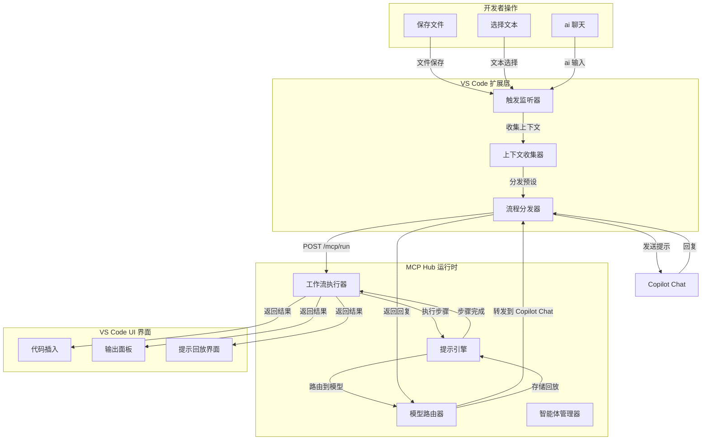
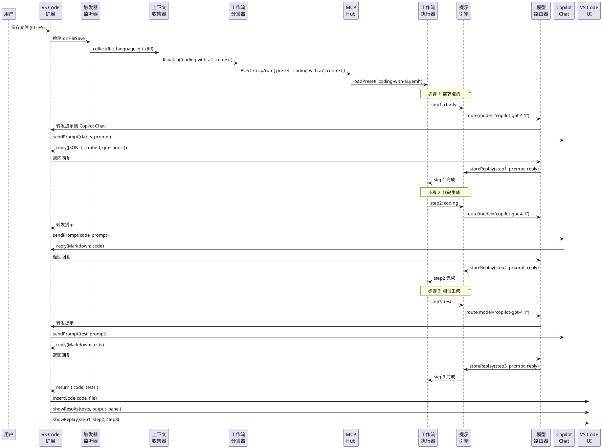

# AI Agent Hub

**语言**: [English](./README.md) | [中文](#)

**AI Agent Hub** 是一个强大的 VS Code 扩展，专门用于增强 Copilot Chat 的 AI 编程体验。它通过结构化的多步骤工作流、智能上下文收集和专业智能体协作，将简单的聊天交互转换为复杂的专业编程助手。

🚀 **当前版本**: 0.0.1 (MVP - 概念验证)

## 🎯 项目目标

**为开发人员提供更好的 Copilot Chat AI 编程体验**

- **结构化工作流**: 通过YAML预设定义复杂的多步骤AI编程流程
- **智能上下文**: 自动收集项目上下文，让AI更好理解代码意图  
- **透明可控**: 完整的Prompt回放和调试面板，追踪每一步AI推理过程
- **自动化触发**: 文件保存、代码选择或聊天输入时自动启动相应工作流
- **多智能体协作**: coder、tester、requirements等专业智能体协同工作

## 🆚 **与普通 Copilot Chat 的对比**

| 功能特性 | 普通 Copilot Chat | AI Agent Hub |
|---------|------------------|-------------|
| **交互方式** | 单次问答 | 多步骤结构化工作流 |
| **上下文理解** | 当前文件 | 项目级上下文 + Git差异 |
| **专业化程度** | 通用AI助手 | 专业编程智能体协作 |
| **工作流程** | 手动引导 | 自动化触发和执行 |
| **透明度** | 黑盒操作 | 完整Prompt回放和调试 |
| **可定制性** | 固定模式 | YAML配置的灵活工作流 |
| **质量保证** | 依赖用户验证 | 内置测试生成和验证 |
| **学习曲线** | 即用即学 | 一次配置，长期受益 |

### 🎯 **适用场景**

**使用普通 Copilot Chat 当你需要:**
- 快速代码片段生成
- 简单问题解答
- 临时代码解释

**使用 AI Agent Hub 当你需要:**
- 完整功能开发（需求→代码→测试）
- 大规模代码重构
- 团队协作的标准化AI工作流
- 可追溯的AI决策过程
- 企业级代码质量保证

## 📐 系统架构



### ⏱ 示例序列图（保存文件触发）



## 🚀 快速开始

### 前置要求

- Node.js >= 18.x
- VS Code >= 1.80.0
- GitHub Copilot 订阅

### 安装步骤

1. 克隆仓库:
   ```bash
   git clone https://github.com/pjy998/ai-agent-hub.git
   cd ai-agent-hub
   ```

2. 安装依赖:
   ```bash
   npm install
   ```

3. 构建和启动:
   ```bash
   npm run build
   cd packages/ai-agent
   npm run start
   ```

### 使用方法

- **聊天触发**: 在 Copilot Chat 中输入 `@ai coding` 或 `@ai requirements`
- **保存触发**: 保存文件自动运行 `coding-with-ai.yaml` 工作流
- **选择触发**: 选择代码后右键触发 `refactor.yaml` 工作流
- **提示重放**: 在 `~/.ai-agent-hub/replay/` 查看日志

## 🛠️ 核心功能 (0.0.1)

- **触发器**: `@ai` 聊天、文件保存、文本选择
- **VS Code 扩展**: Copilot Chat GPT-4.1 的中介，将上下文传递给 MCP
- **MCP Hub**:
  - **FlowRunner**: 执行预设 YAML 工作流
  - **PromptEngine**: 多步提示优化
  - **ModelRouter**: 通过扩展转发请求到 Copilot Chat
  - **AgentManager**: 支持编码者、测试者、需求智能体
- **预设**: `coding-with-ai.yaml`、`refactor.yaml`、`requirements-analysis.yaml`
- **提示重放**: 记录提示/回复以保证透明度

## 📂 项目结构

```
ai-agent-hub/
├─ packages/
│  ├─ ai-agent/             # VS Code 扩展
│  │   ├─ package.json
│  │   ├─ src/
│  │   │   └─ extension.ts
│  │   ├─ extension-config.json
│  │   └─ README.md
│  └─ ai-mcp/               # MCP CLI 工具
│      ├─ package.json
│      ├─ src/
│      │   └─ index.ts
│      └─ README.md
├─ agents/
│  └─ presets/
│      ├─ coding-with-ai.yaml
│      ├─ refactor.yaml
│      └─ requirements-analysis.yaml
├─ package.json
├─ README.md
├─ roadmap.md
└─ LICENSE
```

## 🎯 使用场景对比

### 场景1: 代码重构

**简单 Chat Agent**:
```
用户: @agent 帮我重构这段代码 [粘贴代码]
AI: 这是重构后的代码...
```

**AI Agent Hub**:
```yaml
# 自动触发的重构工作流
1. 分析代码质量问题
2. 识别重构机会
3. 生成重构方案
4. 创建验证测试
5. 提供性能对比
```

### 场景2: 新功能开发

**简单 Chat Agent**:
```
用户: @agent 帮我实现用户登录功能
AI: 这是登录代码...
```

**AI Agent Hub**:
```yaml
# 完整的开发工作流
1. 需求澄清和API设计
2. 数据模型设计
3. 业务逻辑实现
4. 单元测试生成
5. 集成测试创建
6. 文档生成
```

## 🤝 贡献指南

查看 `roadmap.md` 了解优先级。Fork 项目，创建分支（`feature/your-feature`），提交 PR。在 GitHub Issues 中报告问题或讨论新功能。

## 📄 许可证

本项目采用 MIT 许可证 - 查看 [LICENSE](LICENSE) 文件了解详情。

## 🔗 相关链接

- [GitHub 仓库](https://github.com/pjy998/ai-agent-hub)
- [问题反馈](https://github.com/pjy998/ai-agent-hub/issues)
- [发展路线图](roadmap.md)
- [English README](README.md)

---

**总结**: AI Agent Hub 不仅仅是一个聊天机器人，而是一个完整的 AI 驱动开发工作流平台，提供结构化、可控、透明的编程辅助体验。