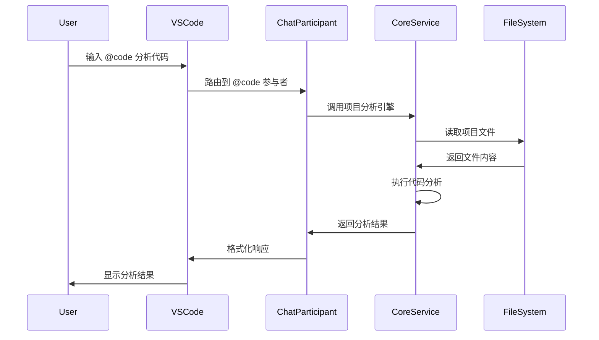
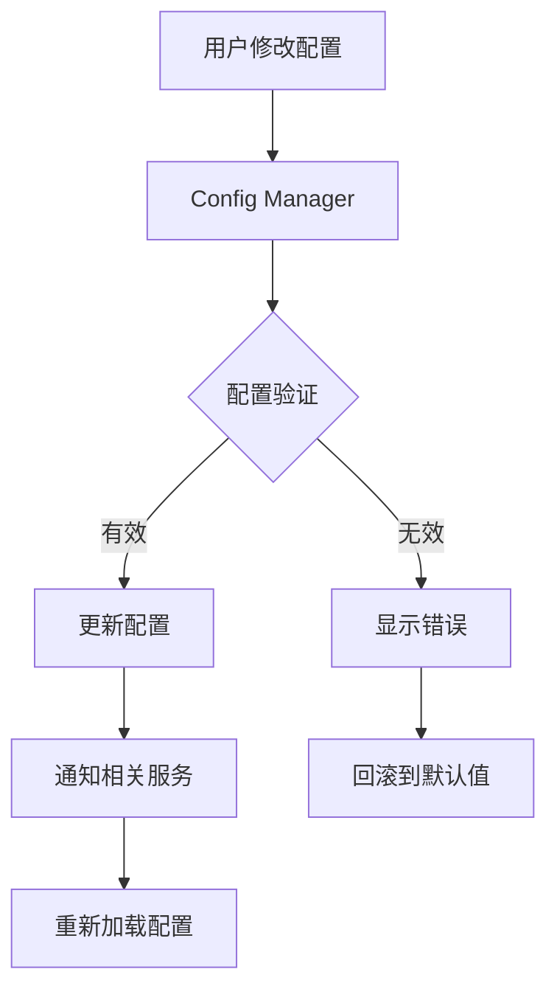

# AI Agent Hub 架构设计

> 基于 VS Code 扩展的简化单体架构设计文档

**版本**: v0.0.23  
**更新日期**: 2025年8月23日

## 概述

AI Agent Hub 采用简化的单体架构，作为 VS Code 扩展运行，通过 Chat 参与者系统提供智能编程辅助功能。该架构摒弃了复杂的 MCP 依赖，专注于核心功能的高效实现。

## 架构原则

### 设计理念
- **简化优先**: 避免过度工程化，专注核心价值
- **原生集成**: 深度集成 VS Code 生态系统
- **高性能**: 最小化外部依赖，提升响应速度
- **易维护**: 单体架构便于开发和部署

### 核心优势
- ✅ 无外部依赖
- ✅ 原生 VS Code 集成
- ✅ 高性能响应
- ✅ 简化部署和维护

## 系统架构

### 整体架构图

```
VS Code Extension (ai-agent-vscode)
├── Chat Participants Layer
│   ├── @code - 代码分析参与者
│   ├── @report - 报告生成参与者
│   ├── @token - Token 管理参与者
│   ├── @config - 配置管理参与者
│   └── @recommend - 推荐系统参与者
├── Core Services Layer
│   ├── Project Analysis Engine - 项目分析引擎
│   ├── Report Generator - 报告生成器
│   ├── Config Manager - 配置管理器
│   ├── Token Manager - Token 管理器
│   └── Language Detector - 语言检测器
├── VS Code Integration Layer
│   ├── Extension Commands - 扩展命令
│   ├── Chat API Integration - Chat API 集成
│   ├── File System Operations - 文件系统操作
│   └── UI Components - 用户界面组件
└── Data Layer
    ├── Configuration Storage - 配置存储
    ├── Cache Management - 缓存管理
    └── Report Storage - 报告存储
```

### 组件详细设计

#### 1. Chat 参与者层 (Chat Participants Layer)

**@code 参与者**
- 功能：多语言代码分析和优化建议
- 支持语言：C#, JavaScript, TypeScript, Python, Java, Go 等
- 核心能力：代码质量评估、性能分析、最佳实践建议

**@report 参与者**
- 功能：项目分析报告生成
- 报告类型：项目概览、技术栈分析、代码质量报告
- 输出格式：Markdown, HTML, JSON

**@token 参与者**
- 功能：Token 使用情况监控和优化
- 监控指标：Token 消耗、API 调用频率、成本分析
- 优化建议：提示词优化、批处理建议

**@config 参与者**
- 功能：扩展配置管理
- 配置范围：用户设置、工作区设置、项目特定配置
- 管理功能：配置验证、默认值管理、配置迁移

**@recommend 参与者**
- 功能：智能推荐和最佳实践
- 推荐类型：代码改进、工具推荐、学习资源
- 个性化：基于项目类型和用户偏好

#### 2. 核心服务层 (Core Services Layer)

**Project Analysis Engine**
```typescript
interface IProjectAnalysisEngine {
  scanProject(rootPath: string): Promise<ProjectScanResult>;
  analyzeCodeQuality(files: FileInfo[]): Promise<QualityReport>;
  detectTechnologies(project: ProjectInfo): Promise<TechStack>;
  generateRecommendations(analysis: AnalysisResult): Promise<Recommendation[]>;
}
```

**Report Generator**
```typescript
interface IReportGenerator {
  generateProjectReport(analysis: ProjectAnalysis): Promise<Report>;
  generateCodeQualityReport(quality: QualityAnalysis): Promise<Report>;
  exportReport(report: Report, format: ReportFormat): Promise<string>;
}
```

**Config Manager**
```typescript
interface IConfigManager {
  getConfiguration<T>(section: string): T;
  updateConfiguration(section: string, value: any): Promise<void>;
  validateConfiguration(config: any): ValidationResult;
}
```

**Token Manager**
```typescript
interface ITokenManager {
  trackTokenUsage(operation: string, tokens: number): void;
  getUsageStatistics(timeRange: TimeRange): UsageStats;
  optimizePrompts(prompts: string[]): Promise<OptimizedPrompt[]>;
}
```

**Language Detector**
```typescript
interface ILanguageDetector {
  detectLanguages(projectPath: string): Promise<LanguageInfo[]>;
  analyzeFileType(filePath: string): FileTypeInfo;
  getLanguageConfig(language: string): LanguageConfig;
}
```

#### 3. VS Code 集成层 (VS Code Integration Layer)

**Extension Commands**
- `ai-agent.csharp-analysis`: C# 代码分析
- `ai-agent.token-probe`: Token 使用情况检查
- `ai-agent.self-project-scan`: 项目自扫描
- `ai-agent.generate-report`: 生成项目报告
- `ai-agent.optimize-config`: 优化配置

**Chat API Integration**
```typescript
interface IChatIntegration {
  registerParticipant(participant: ChatParticipant): void;
  handleChatRequest(request: ChatRequest): Promise<ChatResponse>;
  sendMessage(message: string, participant: string): Promise<void>;
}
```

**File System Operations**
```typescript
interface IFileSystemOperations {
  readFile(path: string): Promise<string>;
  writeFile(path: string, content: string): Promise<void>;
  scanDirectory(path: string): Promise<FileInfo[]>;
  watchFiles(patterns: string[]): FileWatcher;
}
```

## 数据流设计

### 典型交互流程



### 配置管理流程



## 技术栈

### 开发技术
- **主要语言**: TypeScript 5.0+
- **运行时**: Node.js 16+
- **平台**: VS Code Extension API
- **Chat 集成**: GitHub Copilot Chat API

### 构建工具
- **包管理**: npm
- **构建工具**: webpack
- **代码检查**: ESLint + Prettier
- **测试框架**: Jest

### 依赖管理
```json
{
  "dependencies": {
    "vscode": "^1.74.0",
    "@types/vscode": "^1.74.0"
  },
  "devDependencies": {
    "typescript": "^5.0.0",
    "webpack": "^5.0.0",
    "jest": "^29.0.0"
  }
}
```

## 部署架构

### 扩展打包
```
ai-agent-vscode.vsix
├── extension.js (主入口)
├── package.json (扩展清单)
├── README.md
├── CHANGELOG.md
└── assets/
    ├── icons/
    └── templates/
```

### 安装流程
1. 用户从 VS Code Marketplace 安装
2. VS Code 自动下载并安装 .vsix 文件
3. 扩展激活并注册 Chat 参与者
4. 用户可立即使用 @code, @report 等功能

## 扩展性设计

### 插件化架构
```typescript
interface IExtensionPoint {
  name: string;
  register(plugin: IPlugin): void;
  unregister(pluginId: string): void;
}

interface IPlugin {
  id: string;
  name: string;
  activate(context: ExtensionContext): void;
  deactivate(): void;
}
```

### 支持的扩展点
- **语言支持**: 新增编程语言分析器
- **报告格式**: 自定义报告模板和格式
- **分析规则**: 添加代码质量检查规则
- **Chat 参与者**: 创建自定义 Chat 参与者

## 安全考虑

### 数据安全
- 本地处理：所有分析在本地进行，不上传代码
- 配置加密：敏感配置信息加密存储
- 权限控制：最小权限原则，仅访问必要的文件

### API 安全
- Token 管理：安全存储和传输 API Token
- 请求限制：防止 API 滥用的频率限制
- 错误处理：避免敏感信息泄露

## 性能优化

### 缓存策略
- **文件缓存**: 缓存文件分析结果
- **配置缓存**: 缓存配置信息
- **报告缓存**: 缓存生成的报告

### 异步处理
- **非阻塞操作**: 所有 I/O 操作异步执行
- **批处理**: 批量处理文件分析请求
- **懒加载**: 按需加载分析模块

### 内存管理
- **对象池**: 重用分析对象
- **垃圾回收**: 及时清理不需要的数据
- **流式处理**: 大文件流式读取和处理

## 监控和日志

### 日志系统
```typescript
interface ILogger {
  debug(message: string, ...args: any[]): void;
  info(message: string, ...args: any[]): void;
  warn(message: string, ...args: any[]): void;
  error(message: string, error?: Error): void;
}
```

### 性能监控
- **响应时间**: 监控各操作的响应时间
- **内存使用**: 跟踪内存使用情况
- **错误率**: 统计错误发生频率

## 未来规划

详细的项目发展规划和版本路线图请参考 [ROADMAP.md](../ROADMAP.md)。

### 架构演进方向
- 保持简化单体架构的核心理念
- 逐步增强扩展性和可维护性
- 优化性能和用户体验
- 实时协作功能
- 云端同步
- 移动端支持

---

**文档维护**: 本文档随架构演进持续更新，确保与实际实现保持一致。