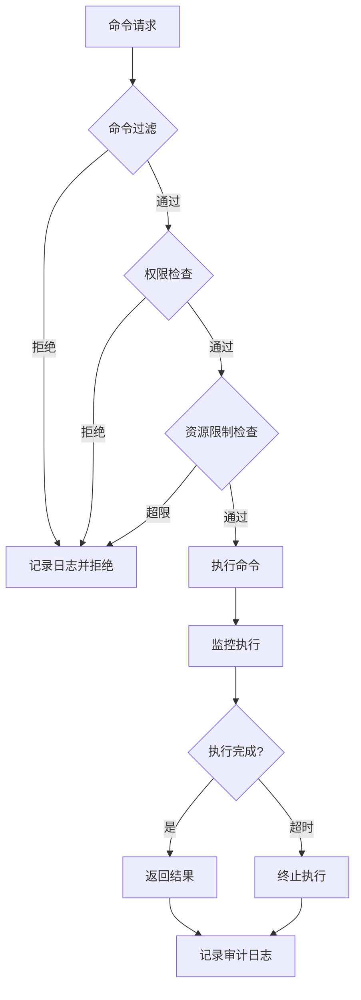
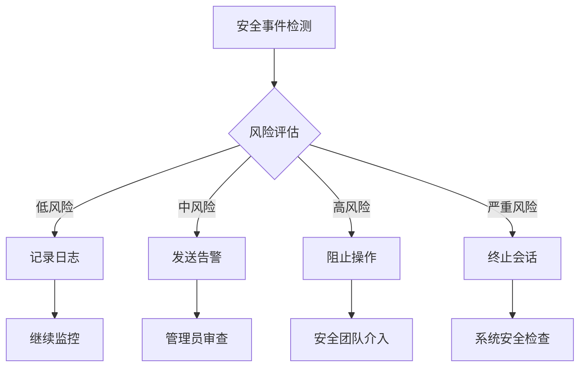

# AI Agent Hub 安全配置指南

## 📋 概述

本文档详细说明了 AI Agent Hub 的安全配置机制，包括工具白名单、权限验证、文件访问控制等安全特性的配置和使用方法。

## 🔒 安全架构

### 多层安全防护

AI Agent Hub 采用多层安全防护机制：

1. **工具白名单控制** - 限制可执行的工具范围
2. **权限验证机制** - 验证工具执行权限
3. **工作区隔离** - 限制文件访问范围
4. **命令过滤** - 阻止危险命令执行
5. **资源限制** - 控制执行时间和资源使用
6. **审计日志** - 记录所有安全相关操作

### 安全配置层级

```
全局安全配置
├── MCP 服务器安全配置
├── 工具系统安全配置
├── AI 服务安全配置
└── 用户会话安全配置
```

## ⚙️ 安全配置

### 1. 全局安全配置

在 `mcp-config.json` 中配置全局安全设置：

```json
{
  "security": {
    "enableGlobalSecurity": true,
    "securityLevel": "strict",
    "auditLogging": {
      "enabled": true,
      "logLevel": "info",
      "logFile": "./logs/security-audit.log",
      "maxLogSize": "100MB",
      "retentionDays": 30
    },
    "globalLimits": {
      "maxConcurrentSessions": 10,
      "maxExecutionTime": 300000,
      "maxMemoryUsage": "512MB",
      "rateLimiting": {
        "enabled": true,
        "maxRequestsPerMinute": 60,
        "maxRequestsPerHour": 1000
      }
    }
  }
}
```

### 2. 工具安全配置

#### 工具白名单配置

```json
{
  "tools": {
    "security": {
      "enablePermissionCheck": true,
      "workspaceRestriction": true,
      "fileAccessRestriction": true,
      "whitelist": [
        "search_codebase",
        "view_files",
        "update_file",
        "write_to_file",
        "list_dir",
        "run_command"
      ],
      "blacklist": [
        "delete_system_files",
        "modify_system_config",
        "network_access"
      ],
      "allowedCommands": [
        "npm",
        "node",
        "git",
        "code",
        "tsc",
        "eslint",
        "prettier"
      ],
      "blockedCommands": [
        "rm -rf",
        "del /f /s /q",
        "format",
        "shutdown",
        "reboot",
        "passwd",
        "sudo",
        "su"
      ],
      "allowedFileExtensions": [
        ".js", ".ts", ".json", ".md", ".txt", ".yml", ".yaml",
        ".html", ".css", ".scss", ".less", ".vue", ".jsx", ".tsx"
      ],
      "blockedFileExtensions": [
        ".exe", ".bat", ".cmd", ".sh", ".ps1", ".dll", ".so"
      ]
    },
    "limits": {
      "maxExecutionTime": 60000,
      "maxFileSize": 10485760,
      "maxConcurrentExecutions": 3,
      "maxExecutionsPerMinute": 30
    }
  }
}
```

#### 工具权限矩阵

| 工具类别 | 读取权限 | 写入权限 | 执行权限 | 网络权限 | 系统权限 |
|---------|---------|---------|---------|---------|----------|
| 文件系统工具 | ✅ | ✅ | ❌ | ❌ | ❌ |
| 代码分析工具 | ✅ | ❌ | ❌ | ❌ | ❌ |
| 构建工具 | ✅ | ✅ | ✅ | ❌ | ❌ |
| 版本控制工具 | ✅ | ✅ | ✅ | ✅ | ❌ |
| 测试工具 | ✅ | ✅ | ✅ | ❌ | ❌ |
| 部署工具 | ✅ | ✅ | ✅ | ✅ | ⚠️ |
| 实用工具 | ✅ | ❌ | ❌ | ❌ | ❌ |
| 自定义工具 | 🔧 | 🔧 | 🔧 | 🔧 | 🔧 |

> ✅ 允许 | ❌ 禁止 | ⚠️ 受限 | 🔧 可配置

### 3. 文件访问控制

#### 工作区限制配置

```json
{
  "fileAccess": {
    "workspaceRestriction": true,
    "allowedPaths": [
      "${workspaceRoot}",
      "${workspaceRoot}/node_modules",
      "${userHome}/.vscode",
      "${temp}"
    ],
    "blockedPaths": [
      "/etc",
      "/usr/bin",
      "/System",
      "C:\\Windows",
      "C:\\Program Files",
      "${userHome}/.ssh",
      "${userHome}/.aws"
    ],
    "maxFileSize": 10485760,
    "maxDirectoryDepth": 10,
    "symlinkPolicy": "block",
    "hiddenFileAccess": false
  }
}
```

#### 文件操作权限

```typescript
// 文件权限检查示例
interface FilePermission {
  path: string;
  operation: 'read' | 'write' | 'execute' | 'delete';
  allowed: boolean;
  reason?: string;
}

// 权限检查函数
function checkFilePermission(path: string, operation: string): FilePermission {
  // 1. 检查路径是否在允许范围内
  if (!isPathAllowed(path)) {
    return {
      path,
      operation: operation as any,
      allowed: false,
      reason: 'Path is outside allowed workspace'
    };
  }
  
  // 2. 检查文件扩展名
  if (!isExtensionAllowed(path)) {
    return {
      path,
      operation: operation as any,
      allowed: false,
      reason: 'File extension is not allowed'
    };
  }
  
  // 3. 检查操作权限
  if (!hasOperationPermission(operation)) {
    return {
      path,
      operation: operation as any,
      allowed: false,
      reason: 'Operation not permitted'
    };
  }
  
  return {
    path,
    operation: operation as any,
    allowed: true
  };
}
```

### 4. 命令执行安全

#### 命令过滤配置

```json
{
  "commandExecution": {
    "enableFiltering": true,
    "filterMode": "whitelist",
    "allowedCommands": {
      "npm": {
        "allowedArgs": ["install", "run", "test", "build", "start"],
        "blockedArgs": ["publish", "unpublish"],
        "requireConfirmation": ["install"]
      },
      "git": {
        "allowedArgs": ["status", "log", "diff", "add", "commit", "push", "pull"],
        "blockedArgs": ["reset --hard", "clean -fd"],
        "requireConfirmation": ["push", "reset"]
      },
      "node": {
        "allowedArgs": ["--version", "-v"],
        "scriptRestriction": true,
        "allowedScriptPaths": ["${workspaceRoot}"]
      }
    },
    "blockedPatterns": [
      "rm -rf.*",
      "del /f /s /q.*",
      "format.*",
      "shutdown.*",
      "reboot.*",
      "sudo.*",
      "su .*"
    ],
    "timeoutSeconds": 300,
    "maxOutputSize": 1048576
  }
}
```

#### 命令执行流程



### 5. AI 服务安全

#### API 密钥管理

```json
{
  "aiSecurity": {
    "apiKeyManagement": {
      "encryptionEnabled": true,
      "keyRotationEnabled": true,
      "keyRotationInterval": "30d",
      "keyStorage": "secure-vault",
      "keyValidation": true
    },
    "requestFiltering": {
      "enableContentFilter": true,
      "blockedKeywords": [
        "password", "secret", "token", "key", "credential"
      ],
      "maxPromptLength": 10000,
      "rateLimiting": {
        "maxRequestsPerMinute": 30,
        "maxTokensPerHour": 100000
      }
    },
    "responseValidation": {
      "enableValidation": true,
      "maxResponseLength": 50000,
      "contentSafetyCheck": true,
      "codeInjectionPrevention": true
    }
  }
}
```

### 6. 会话安全

#### 会话隔离配置

```json
{
  "sessionSecurity": {
    "enableIsolation": true,
    "sessionTimeout": 3600000,
    "maxConcurrentSessions": 5,
    "sessionEncryption": true,
    "crossSessionDataAccess": false,
    "sessionAuditLogging": true,
    "automaticCleanup": {
      "enabled": true,
      "cleanupInterval": "1h",
      "maxSessionAge": "24h"
    }
  }
}
```

## 🛡️ 安全最佳实践

### 1. 配置安全

- **最小权限原则**：只授予必要的最小权限
- **定期审查**：定期检查和更新安全配置
- **版本控制**：将安全配置纳入版本控制
- **环境隔离**：开发、测试、生产环境使用不同的安全配置

### 2. 工具使用安全

```typescript
// 安全的工具使用示例
class SecureToolManager {
  async executeTool(toolId: string, params: any, context: ExecutionContext) {
    // 1. 验证工具是否在白名单中
    if (!this.isToolWhitelisted(toolId)) {
      throw new SecurityError(`Tool ${toolId} is not whitelisted`);
    }
    
    // 2. 检查用户权限
    if (!await this.checkUserPermission(context.userId, toolId)) {
      throw new SecurityError(`User lacks permission for tool ${toolId}`);
    }
    
    // 3. 验证参数安全性
    const validationResult = await this.validateParams(toolId, params);
    if (!validationResult.valid) {
      throw new SecurityError(`Invalid parameters: ${validationResult.errors}`);
    }
    
    // 4. 应用资源限制
    const limits = this.getToolLimits(toolId);
    const execution = await this.executeWithLimits(toolId, params, limits);
    
    // 5. 记录审计日志
    await this.logExecution(toolId, params, execution, context);
    
    return execution.result;
  }
}
```

### 3. 文件操作安全

```typescript
// 安全的文件操作示例
class SecureFileManager {
  async readFile(path: string, context: ExecutionContext): Promise<string> {
    // 1. 路径规范化
    const normalizedPath = this.normalizePath(path);
    
    // 2. 权限检查
    const permission = this.checkFilePermission(normalizedPath, 'read', context);
    if (!permission.allowed) {
      throw new SecurityError(permission.reason);
    }
    
    // 3. 文件大小检查
    const fileSize = await this.getFileSize(normalizedPath);
    if (fileSize > this.maxFileSize) {
      throw new SecurityError('File size exceeds limit');
    }
    
    // 4. 读取文件
    return await fs.readFile(normalizedPath, 'utf-8');
  }
  
  private normalizePath(path: string): string {
    // 防止路径遍历攻击
    return path.resolve(path).replace(/\.\./g, '');
  }
}
```

### 4. 命令执行安全

```typescript
// 安全的命令执行示例
class SecureCommandExecutor {
  async executeCommand(command: string, args: string[], context: ExecutionContext) {
    // 1. 命令白名单检查
    if (!this.isCommandAllowed(command)) {
      throw new SecurityError(`Command ${command} is not allowed`);
    }
    
    // 2. 参数过滤
    const filteredArgs = this.filterArguments(command, args);
    
    // 3. 环境隔离
    const isolatedEnv = this.createIsolatedEnvironment(context);
    
    // 4. 资源限制
    const execution = await this.executeWithTimeout(
      command,
      filteredArgs,
      isolatedEnv,
      this.commandTimeout
    );
    
    return execution;
  }
  
  private filterArguments(command: string, args: string[]): string[] {
    const allowedArgs = this.getAllowedArgs(command);
    return args.filter(arg => this.isArgAllowed(arg, allowedArgs));
  }
}
```

## 🔍 安全监控

### 1. 审计日志

```json
{
  "auditLog": {
    "timestamp": "2024-01-15T10:30:00Z",
    "level": "INFO",
    "event": "TOOL_EXECUTION",
    "userId": "user123",
    "sessionId": "session456",
    "toolId": "update_file",
    "parameters": {
      "file_path": "/workspace/src/index.ts",
      "operation": "write"
    },
    "result": "SUCCESS",
    "executionTime": 1250,
    "resourceUsage": {
      "memory": "15MB",
      "cpu": "2%"
    },
    "securityChecks": {
      "permissionCheck": "PASSED",
      "pathValidation": "PASSED",
      "contentFilter": "PASSED"
    }
  }
}
```

### 2. 安全指标监控

- **权限拒绝率**：监控权限检查失败的频率
- **异常命令检测**：识别可疑的命令执行模式
- **资源使用监控**：跟踪资源使用情况
- **会话异常检测**：识别异常的会话行为

### 3. 告警配置

```json
{
  "alerting": {
    "rules": [
      {
        "name": "High Permission Denial Rate",
        "condition": "permission_denial_rate > 0.1",
        "severity": "WARNING",
        "action": "notify_admin"
      },
      {
        "name": "Suspicious Command Pattern",
        "condition": "blocked_command_attempts > 5 in 1m",
        "severity": "CRITICAL",
        "action": "block_session"
      },
      {
        "name": "Resource Limit Exceeded",
        "condition": "execution_time > 300s OR memory_usage > 512MB",
        "severity": "ERROR",
        "action": "terminate_execution"
      }
    ]
  }
}
```

## 🚨 安全事件响应

### 1. 事件分类

- **低风险**：权限检查失败、文件访问被拒绝
- **中风险**：多次尝试执行被禁止的命令
- **高风险**：尝试访问系统敏感文件、执行危险命令
- **严重风险**：检测到恶意代码注入、系统入侵尝试

### 2. 响应流程



### 3. 恢复措施

- **会话恢复**：清理受影响的会话数据
- **权限重置**：重新验证用户权限
- **配置更新**：根据事件更新安全配置
- **系统加固**：加强相关安全措施

## 📚 参考资源

- [OWASP 安全编码实践](https://owasp.org/www-project-secure-coding-practices-quick-reference-guide/)
- [NIST 网络安全框架](https://www.nist.gov/cyberframework)
- [VS Code 扩展安全指南](https://code.visualstudio.com/api/references/extension-guidelines#security)
- [Node.js 安全最佳实践](https://nodejs.org/en/docs/guides/security/)

## 🔄 配置更新

本文档会随着系统的更新而持续更新。建议定期查看最新版本以获取最新的安全配置指导。

最后更新：2024-01-15
版本：1.0.0